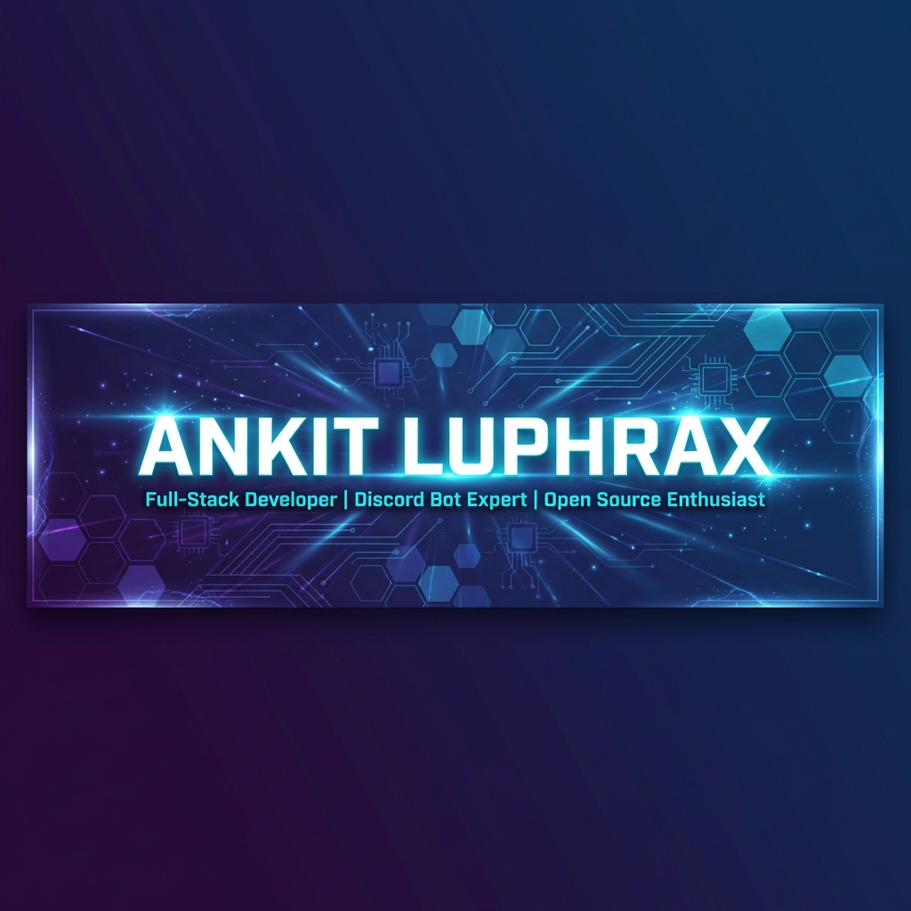

<div align="center">
  
</div>

<div align="center">
  
  [](https://git.io/typing-svg)
  
  <p>
    <a href="https://github.com/AnkitLuphraX"></a>
    <a href="https://github.com/AnkitLuphraX"></a>
    
  </p>
  
</div>

---

## 👨‍💻 About Me

```javascript
const ankit = {
    location: "India 🇮🇳",
    role: "Full-Stack Developer & Discord Bot Specialist",
    currentFocus: "Building enterprise-grade Discord bots",
    learning: ["Advanced Node.js", "System Architecture", "Cloud Technologies"],
    hobbies: ["Coding", "Problem Solving", "Open Source"],
    funFact: "I turn coffee into code ☕ → 💻",
    
    workingOn: {
        project: "Next-Gen Discord Bot System",
        technologies: ["Discord.js", "Node.js", "MongoDB"]
    },
    
    askMeAbout: ["Discord Bots", "Web Dev", "APIs", "Databases"]
};
```

- 🔭 Currently working on **advanced Discord bot systems**
- 🌱 Learning **cloud deployment & scalable architectures**
- 💬 Ask me about **Discord.js, Node.js, MongoDB, Web Development**
- 👯 Looking to collaborate on **open source projects**
- ⚡ Fun fact: **I love automating everything!**

---

## 🛠️ Tech Stack

<div align="center">

### Languages


### Frameworks & Libraries


### Databases & Tools


### DevOps & Cloud


### Development Tools


</div>

---

## 💼 Skill Proficiency

<div align="center">

| Skill | Proficiency |
|-------|-------------|
| **JavaScript/Node.js** |  |
| **Discord.js** |  |
| **MongoDB** |  |
| **React/Next.js** |  |
| **TypeScript** |  |
| **Python** |  |

</div>

---

## 📊 GitHub Statistics

<div align="center">
  
  
</div>

<div align="center">
  
</div>

<div align="center">
  
</div>

---

## 🏆 GitHub Achievements

<div align="center">
  
</div>

---

## 🚀 Featured Projects

<div align="center">

### 🤖 Discord Bot Projects
*Building next-generation Discord bots with advanced features*

[](https://github.com/AnkitLuphraX)
[](https://github.com/AnkitLuphraX)

### 🌐 Web Development
*Creating beautiful and functional web applications*

[](https://github.com/AnkitLuphraX)
[](https://github.com/AnkitLuphraX)

</div>

---

## 📫 Connect With Me

<div align="center">
  
  [](https://github.com/AnkitLuphraX)
  [](https://discord.com)
  [](https://linkedin.com)
  [](mailto:your.email@example.com)
  
</div>

---

## 💡 Random Dev Quote

<div align="center">
  
  
  
</div>

---

## 🎯 Current Goals for 2026

- 🚀 Contribute to more open source projects
- 📚 Master cloud architecture and DevOps
- 🤝 Collaborate with developers worldwide
- 💼 Build impactful projects that solve real problems
- 📖 Share knowledge through technical writing

---

<div align="center">
  
  ### ✨ Thanks for visiting! Let's build something amazing together! ✨
  
  
  
  
  
</div>
